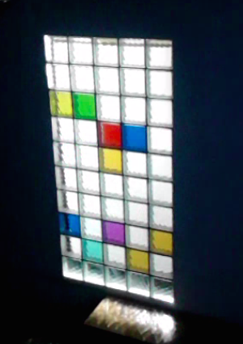
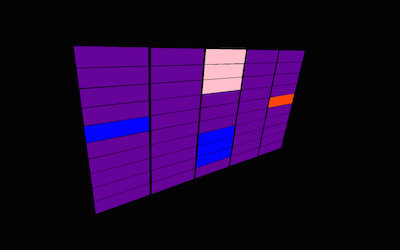
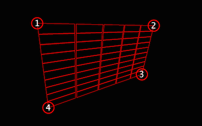

# LuxferClient
The client handles perspective projection of a small patch (5x10 window) of the Game of Life. It is designed to run on small embedded computers such as the Raspberry Pi.

This repository contains the whole source code and NetBeans project metadata which might be useful for people who want to build or modify it in short time. It also contains compiled JAR file and `luxfer.zip` distribution file with the latest version so that no compilation is needed to launch the application.

The client is a part of the "Mystic Wall" installation realized in 2015 by Matúš Buranovský, Adam Heinrich and Jan Husák during the ITT course held by the [Institute of Intermedia](http://iim.cz) at the [Czech Technical University in Prague](http://cvut.cz).

## About

The client is used to project N-by-M rectangular cell matrix on a flat surface. In an original installation the surface was a glass brick wall which required precise mapping of the cells.

To map cells on a glass brick wall (an to compensate beamer's pose) the application uses a projective transformation. The transformation is determined by position of four corner points. This can be adjusted in the configuration mode:

## How to install on Raspberry Pi

1. Get a fresh installation of the [Raspian](http://downloads.raspberrypi.org/raspbian_latest) distribution

2. Build the project (ie. using [NetBeans IDE](https://netbeans.org/)) and run `./build.sh` to generate luxfer.zip

3. Unzip luxfer.zip into home directory (creating directory `/home/pi/luxfer`)

4. Run `sudo apt-get update` & `sudo apt-get upgrade`

5. Install Oracle's Java (if not already present)

6. Run `sudo raspi-config` and select boot to GUI

7. Create file `~/.config/lxsession/LXDE-pi/autostart` and add line:
	
		@xset s noblank
		@xset s off
		@xset -dpms
		@/home/pi/luxfer/run.sh

8. Edit file `/etc/lightdm/lightdm.conf` and add this into the [SeatDefaults] section:

		xserver-command=X -s 0 -dpms

9. Reboot! :-) The application should now start automatically.

10. Test the application and configure it as described below. Don't forget to backup the generated `luxfer.conf` file

## Controls

The application starts in the **projetion mode** with default confiruation. If the connection to the server is successful, it should start displayng generated patterns. Otherwise it displays just a yellow-blue chessboard pattern.

To adjust application's configuration you have to connect USB keyboard and mouse and switch to the **configuration mode**. Thus could be done either by pressing right mouse button or numbers 1-4 on keyboard.

 - Use numbers 1-4 to select one of the four corner points. Position of the selected point can then be adjusted using mouse
 - To invert mouse's X or Y axes press buttons X or Y, respectively. This can be useful when using back projection or some odd configuration of the beamer
 - To hide or display the mesh press key M. The mesh can be useful  for precise aligning but it consumes more CPU (and makes the application a bit slower, especially when displaying big number of cells)
 - To exit the configuration mode, press key E (or right mouse button)
 - To reload configuration file, press key R
 - To delete configuration file and load default configration, press key D
 - To exit the whole application press Escape

 
The configuration is saved into the `luxfer.conf` file if and only if the mode switches from **configuration** to **projecion** (by pressing key E or roght mouse button). 

## Configuration file

The application can be configured through `luxfer.conf` file. The file is automatically updated when swtiching from the configuration mode.

An example of the file can be seen below:
	
	url = http://luxvery.jan-husak.cz/homepage/getCells
	rowsCount = 10
	colsCount = 5
	cornerPoints[0] = 0.0,0.0
	cornerPoints[1] = 1440.0,0.0
	cornerPoints[2] = 1440.0,878.0
	cornerPoints[3] = 0.0,878.0
	cellWidth = 20
	cellHeight = 20
	cellPadX = 1
	cellPadY = 1
	animationSteps = 10
	mirrorX = false
	mirrorY = false
	drawEditMesh = true

 - **url** is the server URL. The server should provide JSON data described in the next section
 - **rowsCount** and **colsCount** are the number of rows and columns to be shown. The whole scene has 40 columns and 30 rows (40x30), the movable window has 5 columns and 10 (5x10)
 - **cornerPoints[]** is an array of 4 corner points (zero indexed). Corner point IDs can be seen when switching to the configuration mode. Each point is defined by X and Y coordinates in pixels separated by comma (position of the screen's top left corner is 0.0,0.0)
 - **cellWidth** and **cellHeight** are the cell dimensions (in pixels)
 - **cellPadX** and **cellPadY** specify empty space between cells (in pixels)
 -  **animationSteps** is the number of frames to be drawn when the cell changes its color. This number of frames is played during an fixed time interval of 1 second
 - **mirrorX** and **mirrorY** specify whhether mouse's X or Y axis should be inverted in the configuration mode (boolean values true/false, see the Controls section, keys X and Y)
 - **drawEditMesh** specifies whether a mesh should be drawn in the configuration mode (boolean values true/false, see the Controls section, key M)

## Communication with the server

[The server](https://github.com/luxfer/luxfer-server) is responsible for generating patterns to be displayed. The pattern is changed every second. Server should provide a simple JSON-formatted channel which is accessible via HTTP (its URL is specified in the `luxfer.conf` configuration file):

	{
		"selection":
			{
				"x": "25",
				"y": "13"
			},
		"cells": [0, 0, ..., 0, 0],
		"background": "660099"
	}

 - **selection**'s **x** and **y** fields specify the location of the 5x10 window's top left corner
 - **cells** is an array of 1200 numbers (40 columns and 30 rows). Every number represent one cell's color. The color of cell located at position x, y is represented by number `cells[40*y+x]`
 - **background** is a hexadecimal RGB representation of the background color

Color indexes:

| Index | Color            |
|-------|------------------|
| 0     | background color |
| 1     | F80000           |
| 2     | FF4500           |
| 3     | 00FF00           |
| 4     | 99FF00           |
| 5     | FFFF00           |
| 6     | FF00FF           |
| 7     | 66FFFF           |
| 8     | 3300FF           |
| 9     | 0000FF           |
| 10    | FFFFCC           |
| 11    | 660099           |
| 12    | FFC0CB           |
| 13    | 222222           |

## Credits

The project uses code from two open source libraries, namely:

Perspective filter from [Java Image Filters](http://www.jhlabs.com/ip/filters/index.html) by Jerry Huxtable. License notice:

	Copyright 2006 Jerry Huxtable

	Licensed under the Apache License, Version 2.0 (the "License");
	you may not use this file except in compliance with the License.
	You may obtain a copy of the License at

	   http://www.apache.org/licenses/LICENSE-2.0

	Unless required by applicable law or agreed to in writing, software
	distributed under the License is distributed on an "AS IS" BASIS,
	WITHOUT WARRANTIES OR CONDITIONS OF ANY KIND, either express or implied.
	See the License for the specific language governing permissions and
	limitations under the License.

JSON parser from [JSON-java](https://github.com/douglascrockford/JSON-java) by Douglas Crockford. License notice:
	
	
	Copyright (c) 2002 JSON.org

	Permission is hereby granted, free of charge, to any person obtaining a copy
	of this software and associated documentation files (the "Software"), to deal
	in the Software without restriction, including without limitation the rights
	to use, copy, modify, merge, publish, distribute, sublicense, and/or sell
	copies of the Software, and to permit persons to whom the Software is
	furnished to do so, subject to the following conditions:

	The above copyright notice and this permission notice shall be included in all
	copies or substantial portions of the Software.

	The Software shall be used for Good, not Evil.

	THE SOFTWARE IS PROVIDED "AS IS", WITHOUT WARRANTY OF ANY KIND, EXPRESS OR
	IMPLIED, INCLUDING BUT NOT LIMITED TO THE WARRANTIES OF MERCHANTABILITY,
	FITNESS FOR A PARTICULAR PURPOSE AND NONINFRINGEMENT. IN NO EVENT SHALL THE
	AUTHORS OR COPYRIGHT HOLDERS BE LIABLE FOR ANY CLAIM, DAMAGES OR OTHER
	LIABILITY, WHETHER IN AN ACTION OF CONTRACT, TORT OR OTHERWISE, ARISING FROM,
	OUT OF OR IN CONNECTION WITH THE SOFTWARE OR THE USE OR OTHER DEALINGS IN THE
	SOFTWARE.